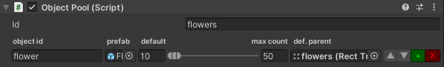
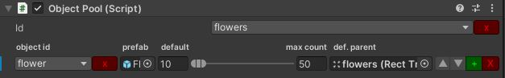

# Object Pool & Inspector

Use ObjectPool to instantiate game objects during loading time and not during gameplay.
This version allows you to have multiple pools in your game, so you can have a global one that won't be destroyed between scenes, and some level-specific ones.



> *To get it persistent between scenes attach a DontDestroyOnLoad script on the same Game Object.*

## Usage

### Basic

1. Use the provided Prefab or put the ObjectPool script in a game object that won't be destroyed during your game, and add the prefabs you want in the list in the inspector. Set the buffered amount, the default parent *(optional)*, and you're set.
2. Retrieve the object pool with ```ObjectPool.GetObjectPool()```
3. Retrieve an already instantiated game object and use it in your game with ```GetFromPool("prefabName")``` on the object pool.

```C#
ObjectPool.GetObjectPool().GetFromPool("myPrefabName")
```

4. To pool and deactivate a previously instantiated and retrieved game object, use

```C#
ObjectPool.GetObjectPool().Pool(usedObject)
```

### Multiple pools

If you want to have multiple pools on your game, you can specify a different id on the object pool inspector and use it when retrieving the object pool

```C#
ObjectPool.GetObjectPool("myOtherPool")
```

### Generic method

As you would do with the ```Instantiate<T>``` version, you can automatically have a call of ```GetComponent<T>``` from inside the pool.

```C#
CoolClass gg = myPool.GetFromPool<CoolClass>("myCoolPrefabName");
```

## Extension: String data list

You can now use a list of IDs for both pools and objects as you would do with enum, but without the need of creating ones.

Add FRP_DATA_LIST in the Scripting Define Symbols and make sure the StringDataList package is imported (it's defined in the dependencies so should be there by default when importing this version of the object pool).



For this IDs to be known, create in a ```Resources/datalist``` folder of your project:
- a ```PoolId.txt``` file for pool ids
- a ```ObjectId.txt``` file for the objects ids.

You can add one or the other or both, it's up to you.